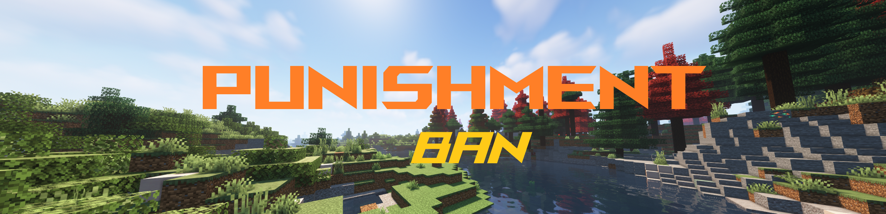

## `Cubic Moderation is a simple Minecraft Plugin for Moderation on your Server.`
## `by TheBjoRedCraft - 2024`
#
#

## `  Ban a player for a specific duration`
## `Ban a player for a specific reason`
## `All bans will be logged in a file`

## `Kick a player for a specific reason`
## `All kicks will be logged in a file` 
